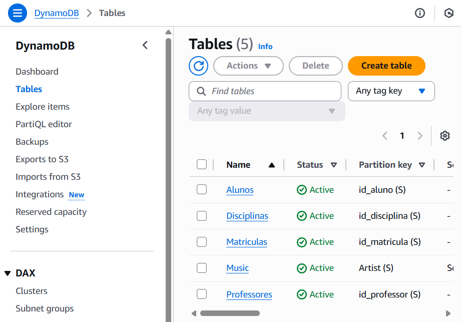

# Projeto Escola - dio-desafio-dynamodb
Este projeto visa estruturar um banco de dados para um sistema escolar, abrangendo alunos, disciplinas, professores e matrículas.

# Estrutura do Banco de Dados

## AWS Console

## Tabelas Principais
- Aluno: Armazena informações dos alunos.
- Professor: Contém dados dos professores.
- Disciplina: Registra as disciplinas oferecidas.
- Matrícula: Associa alunos às disciplinas em que estão matriculados.
## Links para Arquivos
- [Criação das Tabelas](create_tables.bat)
- [Inserção dos Dados](insert_tables.json)
- [Consultas das Tabelas](select_tables.bat)

## Inserir dados nas tabelas (^ - quebra de linha)
```
aws dynamodb batch-write-item ^
    --request-items file://insert_tables.json
```

## Consulta de dados nas tabelas (^ - quebra de linha)
```
aws dynamodb get-item ^
  --table-name Matriculas ^
  --key "{\"id_matricula\": {\"S\": \"M001\"}}"
```